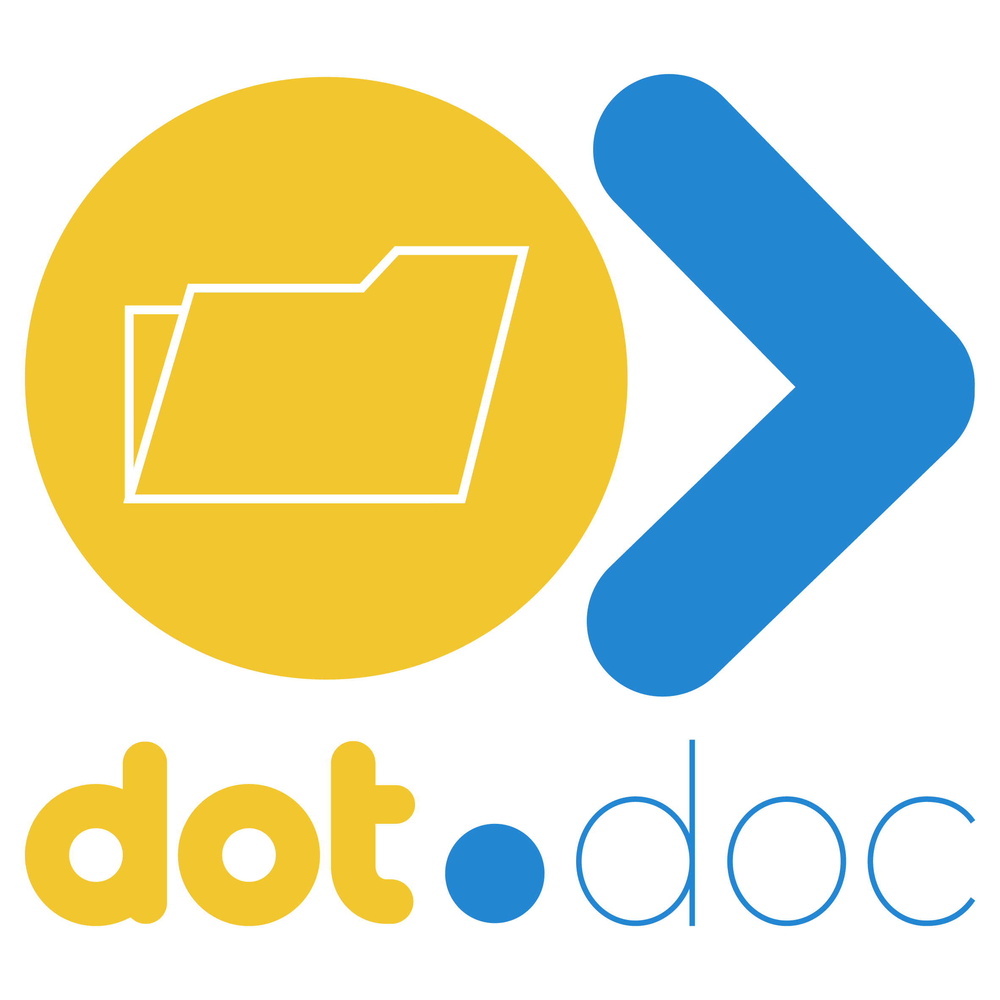

<div align="center">



<h1>Dot.docs</h1>

<p>Collaborative document management — create, edit, organise, and share documents across your team in real time.</p>

[](https://php.net)
[](https://laravel.com)
[](https://livewire.laravel.com)
[](https://postgresql.org)
[](LICENSE)

</div>

---

## Overview

Dot.docs is the document management platform in the Dot ecosystem. Teams create, collaboratively edit, and organise documents with rich-text editing, version history, and real-time presence — all accessible via single sign-on from InfoDot.

---

## Features

- Rich-text document editor with formatting and embeds
- Real-time collaborative editing with presence indicators
- Document folders, workspaces, and team sharing
- Version history with diff view and restore
- Comments and inline annotations
- PDF export
- Full-text search via Laravel Scout
- Ecosystem SSO — authenticate from InfoDot with a single click

---

## Tech Stack

| Layer | Technology |
|---|---|
| Framework | Laravel 12 + PHP 8.4 |
| Frontend | Livewire 3 + Vite + Tailwind CSS |
| Auth | Jetstream 5 + Sanctum (ecosystem SSO) |
| Database | PostgreSQL 16 (shared infodot instance) |
| WebSockets | Laravel Reverb |

---

## Quick Start

```bash
git clone https://github.com/sakhileb/Dot.docs.git && cd Dot.docs
composer install && npm install
cp .env.example .env && php artisan key:generate
php artisan migrate && npm run dev & php artisan serve
```

```bash
bash bin/test.sh   # Run tests
```

---

## Part of the Dot Ecosystem

Dot.docs connects to [InfoDot](https://github.com/sakhileb/InfoDot) — the central hub. Log in to InfoDot once and navigate here without re-authenticating via `/auth/ecosystem`.

---

MIT — © SK Digital / BluPin Incorporated
