<div align="center">



<br /><br />

**Create, edit, organise, and share documents across your team in real time.**

<br />

   

<br /><br />

**Part of the [InfoDot Ecosystem](https://github.com/sakhileb/InfoDot)** &nbsp;·&nbsp; `docs.infodot.app`

</div>

---

## What is Dot.docs?

Dot.docs is the team document platform in the InfoDot ecosystem. Rich-text editing, real-time collaboration, and smart organisation keep your team's knowledge structured and accessible — with full version history and granular sharing controls.

## Core Features

- Rich-text editor with formatting, tables, and embeds
- Real-time multiplayer editing via Laravel Reverb
- Document versioning with named snapshots
- Folder and tag-based organisation
- Template library — start from pre-built layouts
- Comments and inline suggestions with resolution tracking
- Export to PDF, Markdown, and plain text
- Ecosystem SSO from InfoDot hub

## Domain Models

- **Document** — rich-text content with metadata (owner, team, public share settings)
- **DocumentVersion** — snapshot history, auto-created on every save via `DocumentObserver`
- **DocumentCollaborator** — per-user role on a shared document (viewer/editor/admin)
- **Comment** — threaded, resolvable inline annotation (with `parent_id` for replies)
- **AiSuggestion** — a suggested edit awaiting accept/reject (suggestion-mode track changes)
- **DocumentTemplate** — reusable starting layout (global, team-owned, or personal)
- **DocumentSlashCommand** — user- or team-defined `/command` prompt shortcut for the AI assistant
- **DocumentWebhook** — outbound webhook fired on document save/export events

## Tech Stack

| Layer | Technology |
|---|---|
| Framework | Laravel 13 |
| Language | PHP 8.4 |
| Frontend | Livewire 3 · Alpine.js 3 · Tailwind CSS |
| Database | PostgreSQL (shared across ecosystem — `DB_DATABASE=infodot`) |
| Realtime | Laravel Reverb (presence channels, broadcast events) |
| Auth | Laravel Sanctum (InfoDot SSO) + Jetstream Teams |
| AI | OpenAI (`openai-php/laravel`, default model `gpt-4o`) — not Anthropic |
| Storage | Local disk (Flysystem); no S3 config wired in yet |
| Cache / Session / Queue | Database driver (no Redis, Horizon, Scout, or Meilisearch dependency in `composer.json`) |
| Export / Import | `barryvdh/laravel-dompdf` (PDF), `phpoffice/phpword` (Word), `league/html-to-markdown` (Markdown), `jfcherng/php-diff` (version diffs) |

## Quick Start

```bash
git clone https://github.com/sakhileb/Dot.docs.git
cd Dot.docs
cp .env.example .env
composer install
npm install && npm run build
php artisan key:generate
php artisan migrate
php artisan serve
```

> **Ecosystem SSO:** Set `DB_*` env vars to the shared InfoDot PostgreSQL instance and `APP_URL=https://docs.infodot.app`. Users authenticated through InfoDot gain access automatically via Sanctum handoff tokens.

## Ecosystem

**Dot.docs** is one of **21 platforms** in the InfoDot ecosystem, connected via shared PostgreSQL and Sanctum SSO. Visit [InfoDot](https://github.com/sakhileb/InfoDot) to explore the full platform map.

## License

MIT © [SK Digital / BluPin Incorporated](https://github.com/sakhileb)
